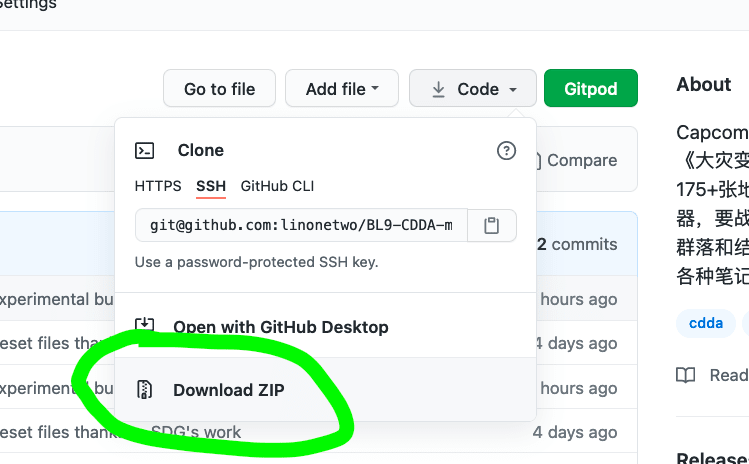

# BL9

一个巨大的内容mod，适用于《大灾变：黑暗的未来》，灵感来自Capcom的《生化危机4》

## 先决条件 

无，但强烈建议您使用BIG内容模组（Magiclysm，Aftershock，Secronom，Cata ++，Arcana，Fallout新英格兰，PK重新平衡，Blazemod），因为此模组的内容相当适中，所以武器，装甲其他模组的平衡变更将派上用场

重要提示-在生成世界的过程中，仅取决于您选择的MONSTER_RESILIENCE修改器的3个版本中的一个

## 您将体验的：主要功能

1）添加超过175张以上的地图-巨大的疯狂古卡斯尔兰城堡，军事严密的守卫岛，各种自定义独特的结构生物群系，这些生物群系受到各种种类的怪物的极大奖励和首领战斗

2）新枪（30种远程武器-3层，其中2层光滑且独特的可制制弹药-BALLISTICS TOO），独特的可近战武器（使用各种香草武术）和装甲（2层精心制作的结实武器注入BL9的幸存者装甲）

3）危险的怪物和老板在战斗-从邪教徒和全副武装的军事巡逻队到受到严重变异的生物和坚强的上司，受到Capcom怪物的极大启发

4）精心制作的线性平衡系统-您将逐渐从游戏中期的结构和怪物过渡到最终的真正危险的地点和老板，那里有很多有价值的东西可以收集和制作

5）以日记和便笺形式出现的独特知识-了解秘密组织，“ BL9”生物的起源以及想要建立新世界秩序的邪恶派别的邪恶计划

6）由阿克玛（Axema）完成的独特的商人NPC系统-从BL9怪物那里收集货币并购买1级和2级远程武器和盔甲-你们在买什么，陌生人？

7）由伟大的图集制作商SomeDeadGuy提供的精心制作的美丽生动，色彩丰富的地形生物群落瓷砖支持-真正生动，美观的生物群落地形

8）由我完成的独特草药治疗系统-您可以在战斗中立即治愈HP的特定部位，但要小心，不要在战斗中过度使用-堆叠的临时减益效果越好，使用时间越长

9）Bright Nights和预嵌套版本支持-没有错误，工作正常-在此处获取它https://mega.nz/file/SJ8iHALb#q9_tnapZGe6PAH1oiPHjuBj3jHHsHWQYbykV0LemV_WY

## Mod开发人员，助手，我最大的支持者

Kenan（英文原版开发者）和 Axema Vales ，以及 Chaosvolt，El-Jekozo / 1123132123，GoatGod，Mutaman，Aptronym 的惊人帮助，以及我忠实的，最伟大的支持者以及启发我的人的大力支持下开发的-Cuddlebaby / Go-Goat ，SomeDeadGuy，SzQ，Mechmaster，ChidingAmoeba，Tefnut，Maleclypse，Dissociativity，Meem，我也要感谢CDDA开发人员-Mark / mlangsdorf传播了有关我的项目的信息，并帮助我解决了我的问题，另一个模仿者，受诅咒的人，神秘主义者帮助我解决我的问题，Kevin Granade致力于CDDA的盲人/屏幕阅读器可访问性-你们是最好的！

## Kenan 工作的支持者的链接

**1) https://discourse.cataclysmdda.org/t/secronom-zombies-mod-thread/16211**

**2) Legendary UDP tileset by SDG - https://github.com/SomeDeadGuy/UndeadPeopleTileset**

**3) https://github.com/chaosvolt/cdda-arcana-mod**

**4) https://github.com/TheGoatGod/Goats-Mod-Compilation**

**5) https://github.com/captainsawbones/Sly_Mutation_Mod_Medley**

**6) https://github.com/foulman/Fantasy**

**7) https://github.com/El-Jekozo/More_NPC**

**8) https://github.com/Noctifer-de-Mortem/nocts_cata_mod**

**9) https://github.com/foulman/Psioniclysm**

**10) https://discourse.cataclysmdda.org/t/fallout-new-england/17509**

**11) https://github.com/dissociativity/PKs_Rebalancing**

## 链接到Kenan适配的最新声音包

**https://github.com/Kenan2000/Otopack-Mods-Updates**

## 链接到Coolcthulhu的Bright Nights CDDA 分支版

**https://github.com/cataclysmbnteam/Cataclysm-BN**

## 链接到Kenan的CDDA改装服务器

**https://discord.com/invite/xj9E3Sp**
